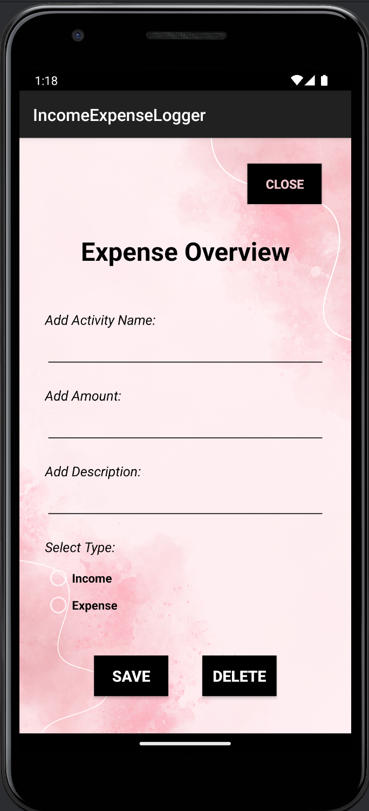
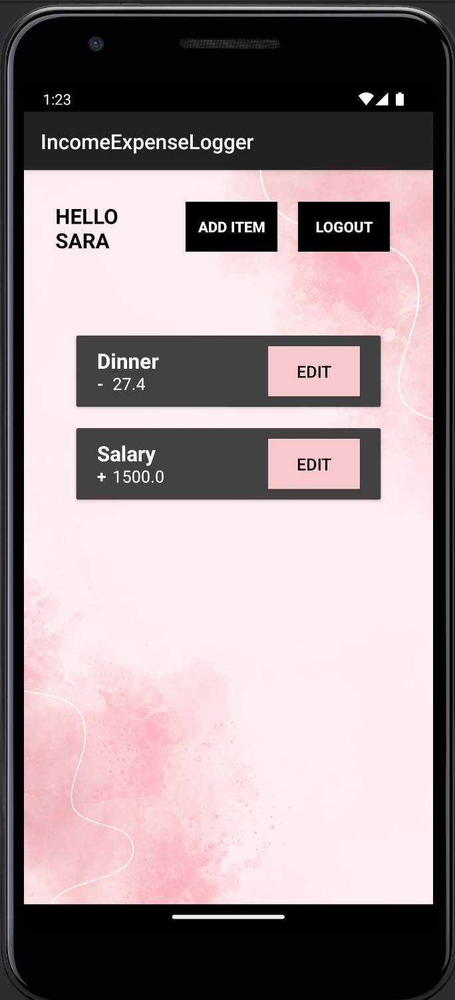

# Problem Statement
Develop an expense/income logging application. The app should consist of three activities and utilize shared preferences, as well as Room/SQLite for data storage. Additionally, the use of a RecyclerView and UI fragments is required.

## Screenshots

## Activity 1: Login and Sign Up
Activity One comprises two fragments: the login and sign-up fragments. Upon opening the app, the login fragment is initially displayed. The Login Fragment includes at least four elements: two input fields (one for the username and the other for the password), a login button for validating details and navigating to Activity Two, and a sign-up button to transition to the Sign-Up Fragment.  

The Sign-Up Fragment consists of a minimum of four elements: three input fields (for profile name, username, and password) and a create button for validating and saving user details. Data storage and retrieval are accomplished using shared preferences.

## Activity 2: Expense Overview
Activity 2 contains a minimum of three elements at the top and a RecyclerView. The three elements consist of two buttons: one for logging out the user and returning to Activity 1, and the other for adding expenses/income, which opens Activity Three. The third element is a text field displaying the profile name of the logged-in user.  

The RecyclerView within Activity 2 contains elements representing expenses/income. Each element in the RecyclerView includes the name of the expense/income, the corresponding amount (using '+' or '-' to indicate income or expense), and an edit button that navigates to Activity Three. Data related to expenses is stored in Room/SQLite for efficient management and retrieval.

## Activity 3: Expense / Input Details
Activity 3 is designed with two distinct modes that share a consistent visual layout but differ in behavior. When the user clicks the add button in Activity 2, Activity 3 opens with all fields empty. Alternatively, when the user clicks the edit button on elements within the RecyclerView in Activity 2, Activity 3 opens with the date pre-filled of the expense/income in the input field, allowing for editing.  

Activity 3 includes a minimum of six elements: three text input fields for the name of the expense/income, amount, and description; a fourth input field for specifying whether it's an expense or income that can be a radio button or toggle; and two buttons—one for saving changes and the other for deletion.  

Two buttons save and delete. The save button not only stores the information but also navigates back to Activity 2. Similarly, the delete button removes the selected entry and returns to Activity 2. In the scenario where the user initiated the process to add but decided to delete, the app seamlessly returns to Activity 2 to streamline the user experience. Data management is handled through Room/SQLite, ensuring consistency with the data source used in Activity 2.
